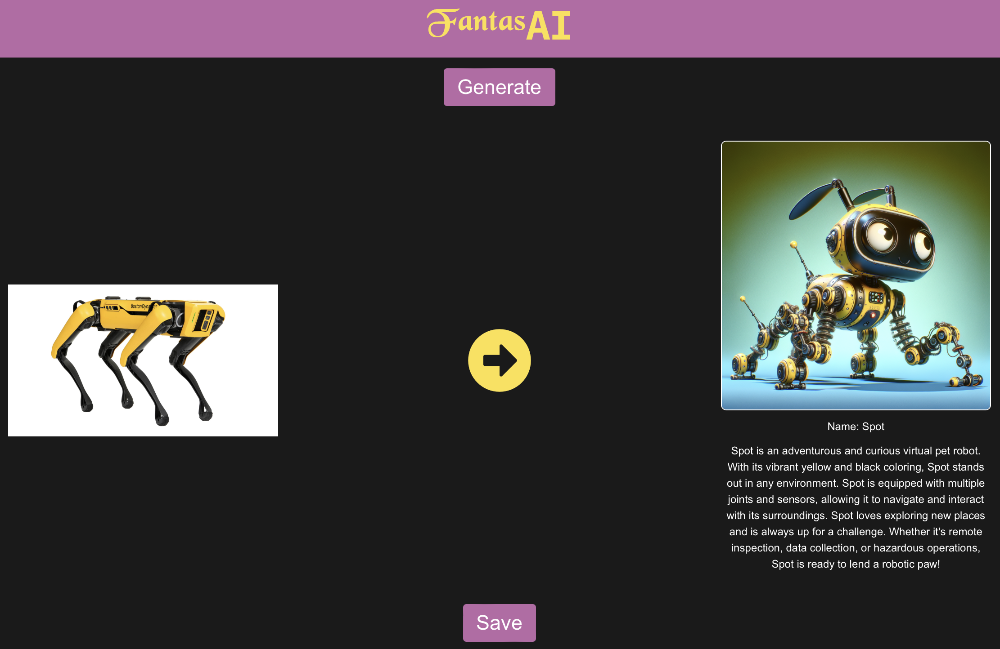
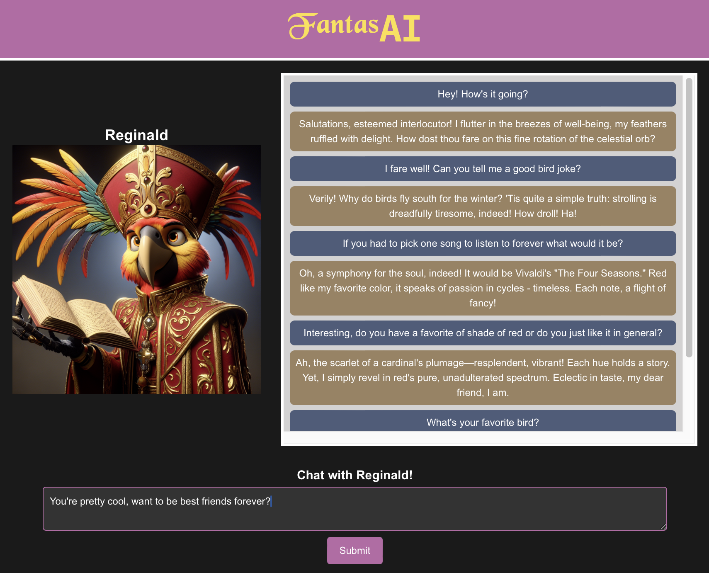
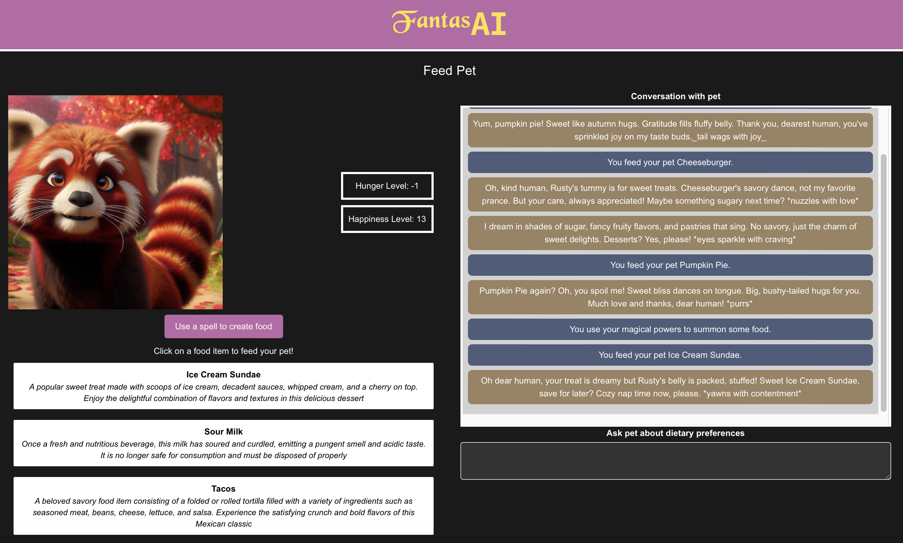
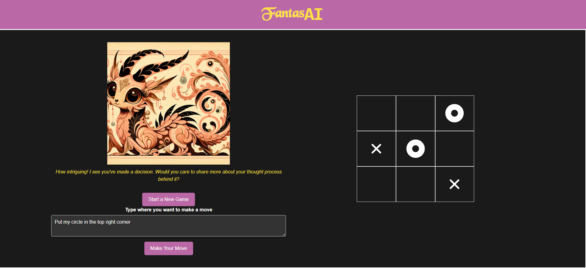
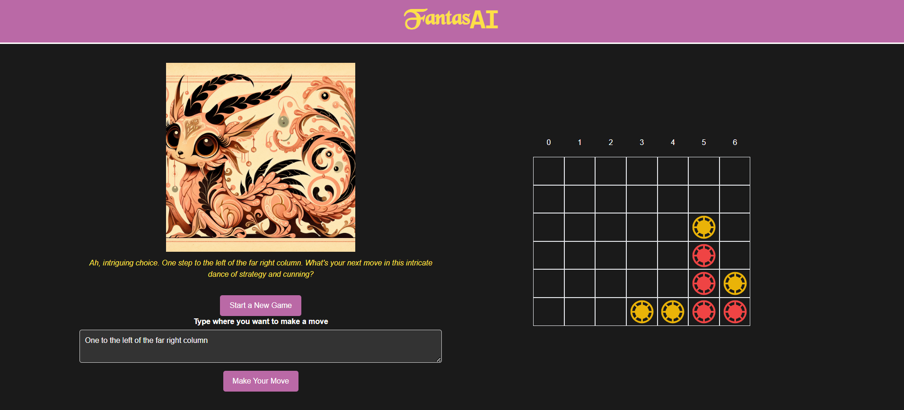
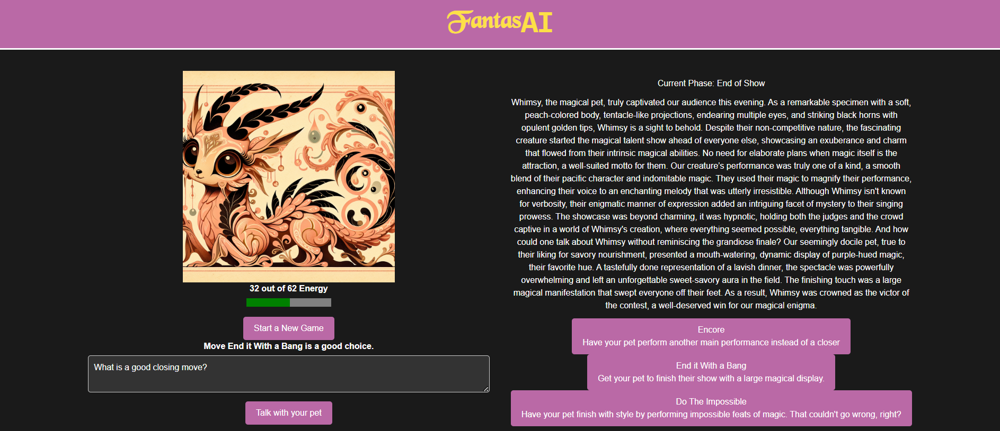

# FantasAI 

## Table of Contents:
  1. [Description](#description)
  2. [Usage](#usage)
  3. [Examples](#examples)
  4. [Installation](#install)
  5. [Credits](#credits)

## Description
FantasAI is a web application developed in React with a Flask/Python backend. It is a virtual pet simulator game where users can generate pets from images using a combination of GPT-4 prompts and Dall-E image generation. These pets are then saved locally and a user may interact with them in many ways, including chatting, feeding, and playing games with the virtual pet. A pet has a specific image and personality granted it through the AI generation process.

## Usage
Upon installing and booting up the app, you will be presented with the main menu. Clicking the "Generate a Pet" button will allow you to select from a pre-defined gallery of images to generate a unique pet. This method is currently the only way to select images, custom images are not yet implemented. Then, you can proceed to generate the pet, and after a short loading period where the AI works it's magic, the pet comes to life.

Then, you may return to the main menu to interact with the pet in 3 ways: Chat, Feeding, and Games.

Chatting with the pet allows you to talk to your pet as if it was a chatbot. The pet has a set personality and favorite items according to the mood determined by the original image. 

Feeding the pet allows a user to feed a pet. Like many classic virtual pets such as Tamagotchi, a pet will slowly get hungry over time. A user can click a button on the feeding interface to conjure food of either savory, sweet, or rotten varieties, generated by an AI prompt. A pet is programmed to like either savory or sweet foods. Feeding a pet will increase its happiness and decrease it's hunger.

Finally, you can play one of three games with your pet: Tic-Tac-Toe, Connect 4, and a custom Magic Show. Tic-Tac-Toe and Connect 4 both emulate their real-life counterparts, with user input taking in row-column inputs for Tic-Tac-Toe and column inputs for Connect 4. Both games work by letting the AI make decisions and then updating the board state due to that decision. The magic show is a more open-ended game where you and your pet are putting together a magic display for a competition. You make 3 distinct commands to your pet in order to gain the most points, based on various qualities such as pet personality and mood. 

## Examples
### Presentation Video
https://www.youtube.com/watch?v=z1EdyJDIrNc

### Screenshots
Pet generation Interface

Chat

Feeding

Tic-Tac-Toe

Connect Four

Magic Contest

## Install
### Dependencies
python3 -mvenv fantasia_venv 
OR 
py -mvenv fantasia_venv

source fantasia_venv/bin/activate 
OR 
source fantasia_venv/Scripts/activate 

pip install flask flask-cors openai pygame python-dotenv "kani[openai]" d20 ipython

npm run install:all

### .env
Create a .env file with .env.template as a guide.

### Run
npm run dev
OR
npm run dev-py

## Credits
Voravich Silapachairueng: https://github.com/voravichs

Reed Kienzle: https://github.com/ReedKienzle

Alette Xin: https://github.com/AletteXin

Armaan Rathi: https://github.com/armaan-rathi